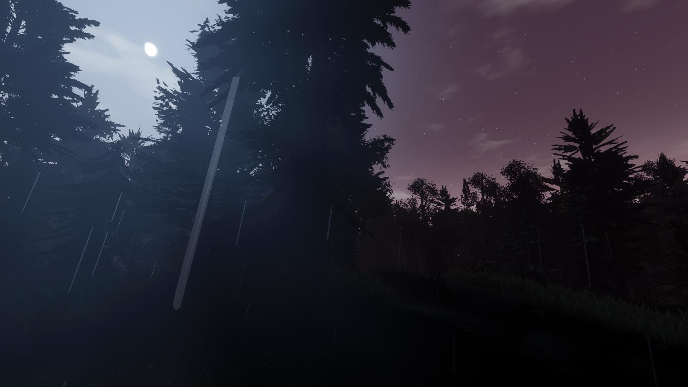
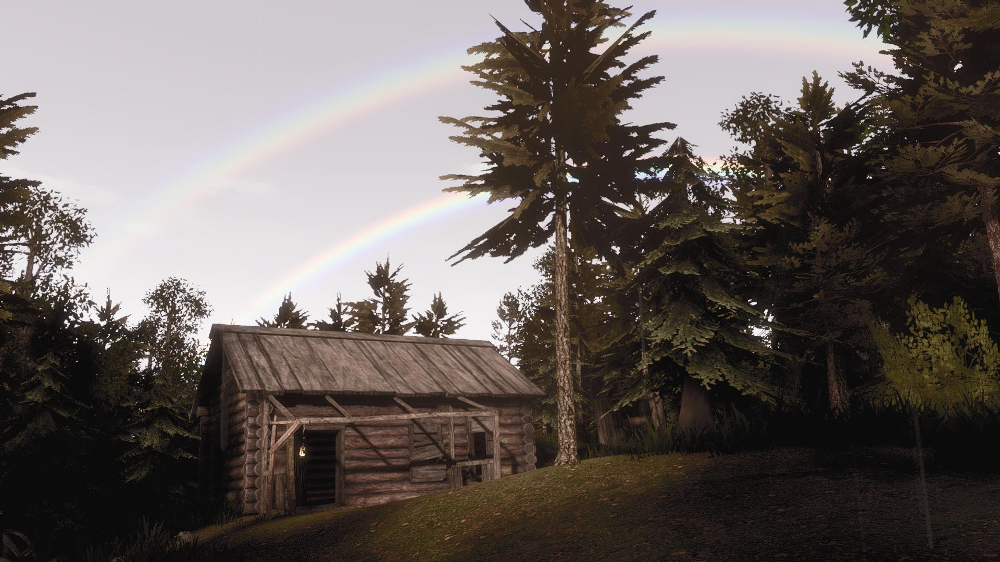
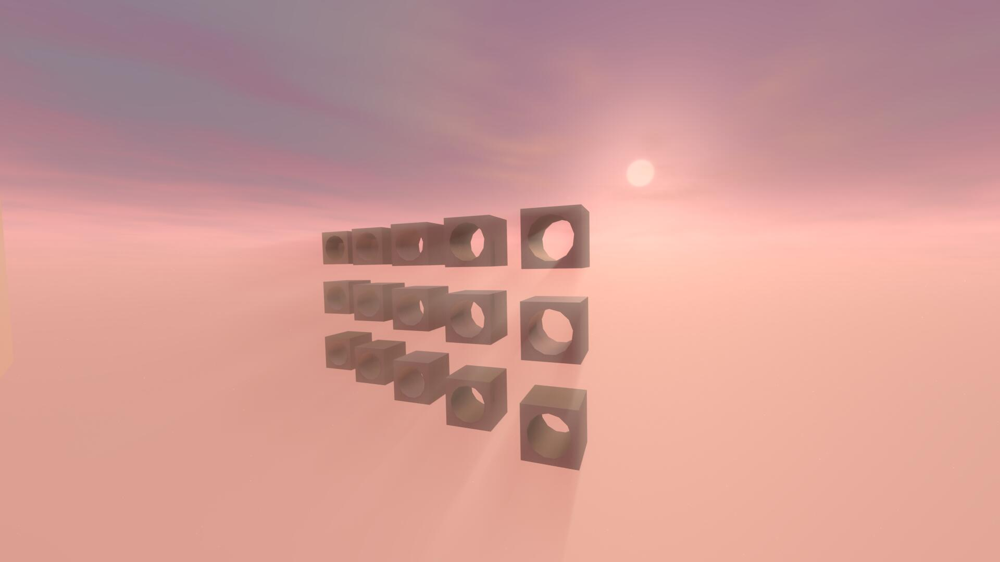
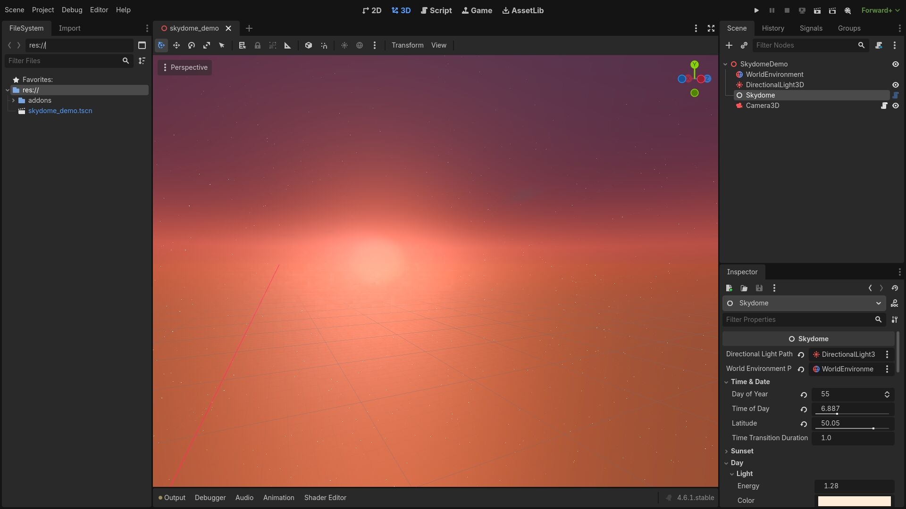

# Godot Skydome

## Features

* time of the day
* day of the year
* sun and moon discs
* stars
* clouds
* rainbow
* atmosphere scattering
* screen space lightshafts (for sun and moon)
* environment control (light, fogs)

## Assumptions

* artistic appearance over physical correctness
* as low gpu cost as possible
* ease of use
* part of bigger ecosystem

## Usage

* Add Skydome node to the 3D scene
* Add DirectionalLight3D and WorldEnvironment
* Create Environment in WorldEnvironment
* Setup Skydome's paths to DirectionalLight3D and WorldEnvironment

